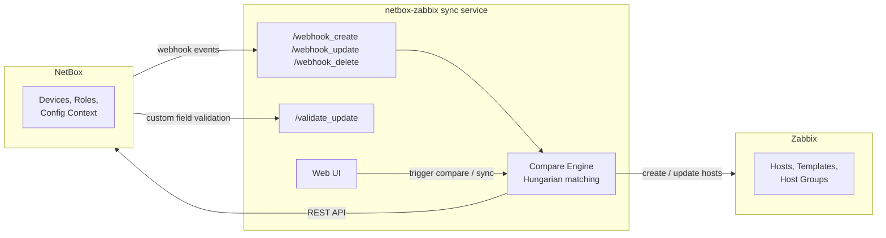

# NetBox ⇄ Zabbix Sync

**Keep Zabbix monitoring in lockstep with NetBox — automatically, in real time.**

Compares device configuration between NetBox and Zabbix and creates/updates Zabbix hosts to match NetBox, driven by NetBox webhooks or an on-demand comparison run. Template and port-type selection follows a configurable priority chain (device → device role → config context), and device matching uses the Hungarian algorithm to reliably pair NetBox and Zabbix hosts even when hostnames drift.

[](https://github.com/LukacMatej/netbox_zabbix_comparator/actions/workflows/ci.yml)


## Table of Contents

- [Features](#features)
- [Architecture](#architecture)
- [Quick Start](#quick-start)
- [Configuration](#configuration)
- [Setup for Proper Application Operation](#setup-for-proper-application-operation)
  - [Priority for Selecting Templates and Port Types](#priority-for-selecting-templates-and-port-types)
  - [Templates](#templates)
  - [Port Type](#port-type)
  - [Primary IP Address](#primary-ip-address)
  - [Zabbix Host Groups](#zabbix-host-groups)
  - [Custom Validation](#custom-validation)
- [REST API](#rest-api)
- [Development](#development)
- [Contributing](#contributing)
- [License](#license)

## Features

- 🔁 **One-way sync, NetBox → Zabbix** — create, update, or leave hosts untouched based on a real diff, not a blind overwrite.
- 🪝 **Webhook-driven** — reacts to NetBox device create/update/delete events as they happen.
- 🔍 **Compare-before-you-sync UI** — review exactly what will change before triggering a sync.
- 🎯 **Hungarian-algorithm device matching** — robustly pairs NetBox and Zabbix hosts even when naming or ordering differs.
- 🧩 **Layered configuration** — templates and port types resolve from device → device role → config context, with automatic fallback.
- ✅ **Custom validation endpoint** — blocks invalid Template/Port Type combinations directly in the NetBox UI before they're saved.
- 🐳 **Single-container deployment** — ships as a small FastAPI + uvicorn Docker image.

## Architecture



## Quick Start

```bash
docker run -d \
  -p <port>:<port> \
  -e LISTEN_ADDRESS=<IP address> \
  -e HTTP_PORT=<port> \
  -e ZABBIX_DEFAULT_HOSTGROUP=<default hostgroup name> \
  -e NETBOX_IP=<NetBox IP address with http://> \
  -e NETBOX_KEY=<NetBox API key> \
  -e ZABBIX_IP=<Zabbix IP address with http://> \
  -e ZABBIX_KEY=<Zabbix API key> \
  -e PROXY_ROOT_PATH=<dev|prod> \
  netbox-zabbix
```

## Configuration

| Variable | Description |
|---|---|
| `LISTEN_ADDRESS` | Address the app listens on inside the container. |
| `HTTP_PORT` | Port the app listens on inside the container. |
| `ZABBIX_DEFAULT_HOSTGROUP` | Fallback Zabbix host group for synced devices. |
| `NETBOX_IP` | Base URL of the NetBox instance, including scheme (`http://`/`https://`). |
| `NETBOX_KEY` | NetBox API token. |
| `ZABBIX_IP` | Base URL of the Zabbix instance, including scheme. |
| `ZABBIX_KEY` | Zabbix API token. |
| `PROXY_ROOT_PATH` | `dev` or `prod` — adjusts routing when running behind a reverse proxy. |

## Setup for Proper Application Operation

### Priority for Selecting Templates and Port Types

The system uses a hierarchical priority when selecting Templates and Port Types. The application looks for values in the following order (1 = highest priority):

#### 1. Device Custom Fields (highest priority)

Set Custom Fields on individual devices:

* `zabbix_templates` - list of Zabbix templates for a specific device
* `zabbix_port_type` - port type for a specific device

#### 2. Device Role Custom Fields

Set Custom Fields on the device role with a selection of Custom Field Choices:

* `zabbix_templates` - list of templates for all devices with this role
* `zabbix_port_type` - port type for all devices with this role

#### 3. Device Config Context (lowest priority)

In NetBox, you can set an inheritable config context for device roles, which is automatically applied to all devices with that given role:

```json
{
    "zabbix": {
        "port_type": [
            "Agent"
        ],
        "templates": [
            "Template1",
            "Template2"
        ]
    }
}
```

**Important:** If a higher priority level contains no values (it is empty or None), the system automatically falls back to a lower priority.

### Templates

* Templates that will be applied to devices in Zabbix
* They must exist in Zabbix beforehand
* Supports multiple templates at once
* A NetBox script is available to synchronize Custom Field Choices named `zabbix_templates` with templates in Zabbix. For a similar guide, see Zabbix hostgroups.

### Port Type

* Specifies the port type for communication with Zabbix
* Supported types: Agent, SNMP, JMX, IPMI

### Primary IP Address

* A mandatory setting in NetBox for proper operation
* Used as the connection address for the device in Zabbix
* Selected from `primary_ip4` on the device

### Zabbix Host Groups

A NetBox script is available to synchronize Custom Field Choices named `zabbix_hostgroups` with host groups in Zabbix:

* Link Custom Field Choices to a Custom Field named `zabbix_hostgroups`
* Set it as multi-select on DCIM > DEVICE
* The default host group in Zabbix is set to "Netbox" to keep track of all devices created by the synchronization

### Custom Validation

Zabbix has many dependencies regarding the Port Type - Templates relationship. For this reason, a custom validation config was created to communicate with Zabbix and handle these dependencies.

* The custom validator calls the endpoint only when editing custom fields for Zabbix, see above.

##### Procedure:

* Place `device_zabbix_validator.py` into the NetBox root folder
* Insert the following into `configuration/extra.py`:

```python
CUSTOM_VALIDATORS = {
    'dcim.device': (
        'device_zabbix_validator.ZabbixCustomFieldValidator',
    )
}
```

The custom validator calls the comparator's API endpoint `/validate_update` (port 7000, needs to be adjusted if a different one is used).

## REST API

Controlled via the hamburger menu:

### Compare

* Starts the comparison of devices between NetBox and Zabbix
* Displays configuration differences and matches

### Synchronize

* Starts a one-way synchronization from NetBox to Zabbix
* Possible scenarios:
  * Device exists only in NetBox → created in Zabbix
  * Device exists in both → values from NetBox overwrite values in Zabbix (if they differ)
  * Device is identical → nothing happens

### Webhooks

* App listens for webhook events from NetBox and synchronizes Zabbix accordingly
* `/webhook_create`
* `/webhook_update`
* `/webhook_delete`

## Development

```bash
# install dependencies
pip install -r requirements.txt

# run tests
python -m unittest discover -s tests -p 'test_*.py' -v

# lint (matches CI: pylint --fail-under=9, mypy on server.py + app/)
pre-commit run --all-files
```

## Contributing

Contributions are welcome — see [CONTRIBUTING.md](CONTRIBUTING.md) for dev setup, lint/test commands, and PR guidelines.

## License

Released under the [MIT License](LICENSE).
